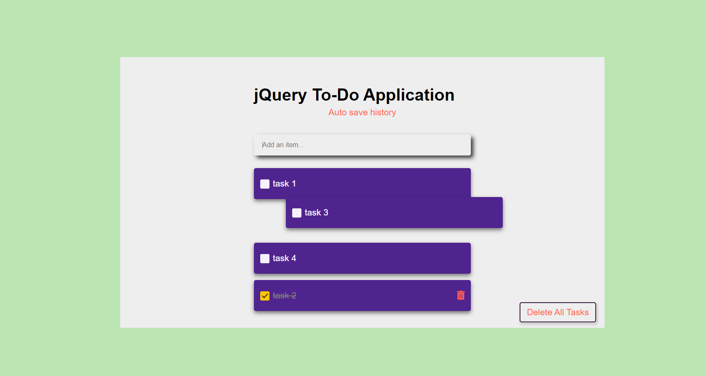
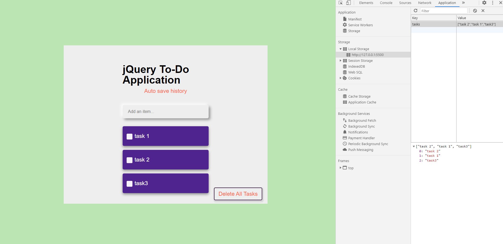
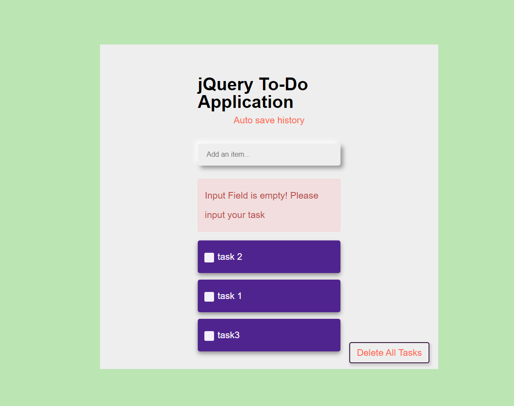

### FS 1010 assignment Day2 Todo list jquery

2021-1-31

html, css, jquery, jquery-ui

**Assignment requirement**

### Please include:

- Users type in the input field and press enter
- When they press enter, use the input value and add it as a list item to the unordered list under the input field.
- When a user clicks on a list item, the checkbox should fill. And text should turn grey to indicate that it has been "done."

### Helpful Tips:

- Start with a "document ready"
- Research "event binding" in jQuery
- You will have to "prevent default" behaviour
- Use concatenation to add HTML elements.

### Optional Extra's to Add:

-allow the removal of items completely from the list

- automatically move completed items to the bottom
- error if input is empty
- Advanced Things to Try:
  drag/drop sort items (have a look at jQuery UI)
- when the page loads focus on the input field (i.e. cursor should load inside input, ready to type)
   

**Todo list has the following features and functions**

- Add item from item input area, and it will display at the list.
- click each item, checkbox is checked, text color becomes gray, showing remove icon, auto move to the bottom of the list
- If empty input, error display. After 2 seconds, page reload, waiting for input.
- can drag each item
- every time page load, focus on input area
- click "delete all tasks" button, all items are removed.
- add style file.
- add localStorage feature.
- click trash bin icon, the bottom item is removed.
- Each function has comment on the top.
   
   
  
   
  
   
  
   
  
