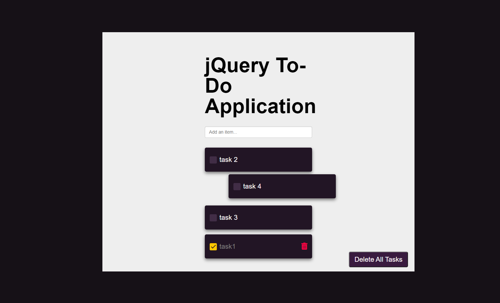

### FS 1010 assignment Day2 Todo list jquery

2021-1-31

html, css, jquery, jquery-ui

- Add item from item input area, and it will display at the list.
- click each item, checkbox is checked, text color becomes gray, showing remove icon, auto move to the bottom of the list
- If empty input, error display. After 2 seconds, page reload.
- can drag each item
- every time page load, focus on input area
- click "delete all tasks" button, all items are removed.
- add style file.
- add localstorage feature.
   
  
